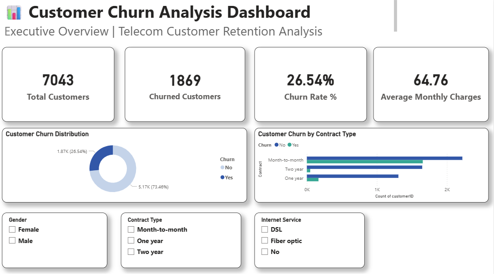
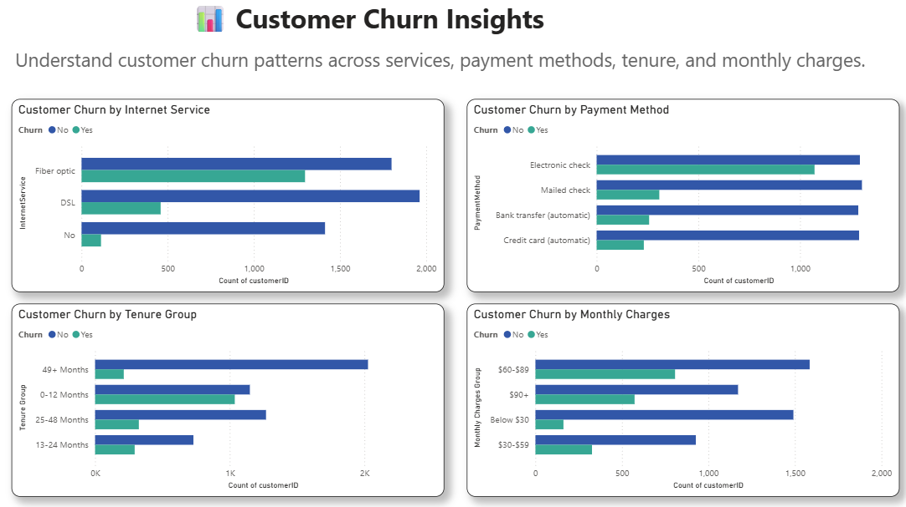

# Customer-Churn-Analysis
End-to-End Customer Churn Analysis using SQL, Python, and Power BI
# 📊 Customer Churn Analysis Dashboard

## 📌 Project Overview

This project analyzes customer churn in a telecom company using SQL, Python, and Power BI. The goal is to identify the factors contributing to customer churn and provide business insights that help improve customer retention.

---

## 🛠️ Tools Used

- SQL
- Python (Pandas, NumPy, Matplotlib)
- Power BI
- Microsoft Excel

---

## 📂 Project Structure

```
Customer-Churn-Analysis
│
├── Data
├── SQL
├── PYTHON
├── POWER BI
├── REPORTS
├── IMAGES
└── README.md
```

---

## 📊 Dashboard Preview

### Executive Dashboard



### Customer Insights Dashboard



---

## 🔍 Key Business Insights

- Customers on month-to-month contracts have the highest churn.
- Fiber optic users churn more than DSL users.
- Electronic check customers have a higher churn rate.
- Customers with shorter tenure are more likely to leave.
- Higher monthly charges are associated with higher churn.

---

## 💡 Business Recommendations

- Encourage long-term contracts.
- Improve customer onboarding during the first year.
- Review pricing strategies for high monthly charge customers.
- Improve customer retention programs.

---

## 👩‍💻 Author

**Prajakta Panchbuddhe**

Aspiring Data Analyst

Skills:
- SQL
- Python
- Power BI
- Excel
